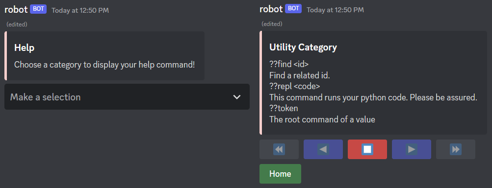

# starlight-dpy
A utility library that she uses for discord.py

This 'library' is still in pre-alpha. This is still
actively being develop and major changes _may_ be made :3

Feel free to open an issue if you found any bugs!🌷

**Do not use this in production.**

### Installation
```
pip install git+https://github.com/InterStella0/starlight-dpy
```

## Menu Help Command
Easily paginate your help command with little effort.
```python
import starlight
import discord

from discord.ext import commands

bot = commands.Bot(
    command_prefix="??",
    help_command=starlight.MenuHelpCommand(
        per_page=10,
        accent_color=0xffcccb,
        error_color=discord.Color.red()
    ),
    intents=discord.Intents.all(),
    description="Demonstration bot"
)
```
**Output**


### Customizing
You can easily customize your help command by overriding `format_*` methods!

Format methods: 
- `format_command_brief(cmd: commands.Command)`
- `format_cog_page(view: HelpMenuCog, data: List[commands.Command])`
- `format_bot_page(view: HelpMenuBot, mapping: Dict[Optional[commands.Cog], List[commands.Command]])`
- `format_group_detail(view: HelpMenuGroup)`
- `format_command_detail(view: HelpMenuCommand)`
- `format_error_detail(view: HelpMenuError)`

**Note:`page` suffix meant the View inherits SimplePaginationView** 

**Example:**
```python
import starlight
import discord

from discord.ext import commands

class MyMenuHelpCommand(starlight.MenuHelpCommand):
    async def format_bot_page(self, view, mapping):
        return discord.Embed(
            title="Help",
            description="Choose a category to display your help command!",
            color=self.accent_color
        )


bot = commands.Bot(
    command_prefix="??",
    help_command=MyMenuHelpCommand(
            per_page=10,
            accent_color=0xffcccb,
            error_color=discord.Color.red(),
            pagination_buttons={
                "start_button": discord.ui.Button(emoji="⏪", row=1),
                "previous_button": discord.ui.Button(emoji="◀️", style=discord.ButtonStyle.blurple, row=1),
                "stop_button": discord.ui.Button(emoji="⏹️", style=discord.ButtonStyle.red, row=1),
                "next_button": discord.ui.Button(emoji="▶️", style=discord.ButtonStyle.blurple, row=1),
                "end_button": discord.ui.Button(emoji="⏩", row=1)
            }
    ),
    intents=discord.Intents.all(),
    description="Demonstration bot"
)
```
**Output**



## Paginate Help Command
Similar to MenuHelpCommand, with a difference where it uses
purely buttons for navigation.
```python
import starlight
import discord

from discord.ext import commands

bot = commands.Bot(
    command_prefix="??",
    help_command=starlight.PaginateHelpCommand(),
    intents=discord.Intents.all()
)
```

**Output**


## Inline View
Create inline view for distinct behaviours with `starlight.inline_view`.

```python
import starlight
import discord

@bot.command()
async def my_command(ctx):
    view = discord.ui.View()
    hi_button = discord.ui.Button(label="hi")
    view.add_item(hi_button)
    await ctx.send("hi", view=view)
    async for interaction, item in starlight.inline_view(view):
        if item is hi_button:
            response = "hi"
        else:
            response = "unknown"
        await interaction.response.send_message(response, ephemeral=True)
```
You can specify a `discord.ui.Item` to listen for a single item.
Effective when you're expecting only a single interaction.

```python
result = None
async for interaction, item in starlight.inline_view(view, item=hi_button):
    result = await view.get_my_result(interaction)
    view.stop()  # ensure only a single sequence

print("My Result:", result)
```
**Note:**
- Interaction callbacks are sequential due to async iterator.
- Always go for View subclasses whenever you can.


## Pagination View
A simple pagination interface.

This was designed to not rely on `discord.ext.menus` due to lack of support
for `Interaction`. Majority of code that was present in `discord.ext.menus`
was dedicated for Reaction which has made it not ideal to be inherited.

```python
import starlight
import discord

class MyPagination(starlight.SimplePaginationView):
    async def format_page(self, interaction, data):
        return discord.Embed(
            title=f"Simple display[{self.current_page + 1}/{self.max_pages}]",
            description="\n".join(data)
        )


@bot.command()
async def my_command(ctx):
    my_data = [["1", "2", "3"], ["4", "5", "6"], ["7", "8", "9"]]
    view = MyPagination(my_data, cache_page=True)
    await view.start(ctx)
```
**Note: You're required to chunk your data on your own. Tips:`discord.utils.as_chunks`**

*Supports `commands.Paginator` with `.from_paginator` classmethod.*

**Output**


## Inline Pagination
Paginating can have distinct formats which could cause boilerplate code. Which leads to the 
creation of Inline Pagination. It works
similarly with Inline View. With a slight change, 
`InlinePaginationItem` are yielded for you to respond it to have an
effect to the message through `.format()` method.

```python
import starlight
import discord

@bot.command()
async def my_command(ctx):
    my_data = [["1", "2", "3"], ["4", "5", "6"], ["7", "8", "9"]]
    view = starlight.SimplePaginationView(my_data, cache_page=True)
    async for item in starlight.inline_pagination(view, context=ctx):
        embed = discord.Embed(
            title=f"Simple display[{view.current_page + 1}/{view.max_pages}]",
            description="\n".join(item.data)
        )
        item.format(embed=embed)  # keyword arguments are passed to `Message.edit`
```

The output of this code is the equivalent of the Pagination View example.

# General Utility
## Search
An extended version of `discord.utils.get()`. However, it is a filter that returns
a sequence. This also supports for fuzzy matching as they are relatively
common to be used within a discord bot.

```python
from starlight import search, Contains
# Contains is alias of ContainsFilter class
items_with_my_value = search(items, my_attr=Contains('my_value'))

# Equivalent of
items_contains_value = [item for item in items if 'my_value' in item.my_attr]
```

## Hybrid Help Command
Hybrid is a term to implement both text and slash command in
discord.py. HelpCommand was explicitly only a text command. To
change it to a hybrid, you can use `starlight.convert_help_hybrid`.

```python
import discord
import starlight
from discord.ext import commands

GUILD_ID = discord.Object(1010844235857149952)
my_help_command = commands.DefaultHelpCommand()
hybrid_help_command = starlight.convert_help_hybrid(my_help_command, guild=GUILD_ID)
bot = commands.Bot(..., help_command=hybrid_help_command)
```
Once you sync your command. You can now use help command in slash command.

**Note:** `convert_help_hybrid` second argument is directly transfered to
the AppCommand parameters.

# References
- [Documentation](https://starlight-dpy.readthedocs.io/en/latest/)
- [Discord.py Docs](https://discordpy.readthedocs.io/en/stable)
